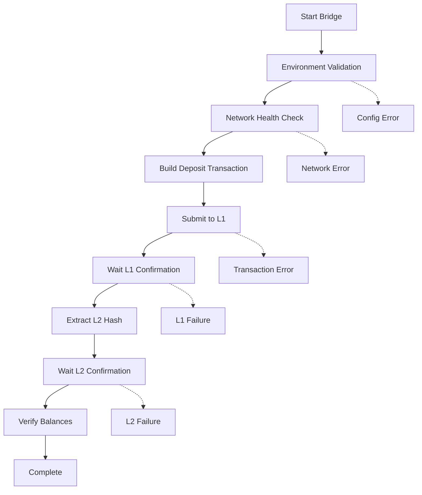

<div align="center">


**ETH bridging from Ethereum Sepolia to GIWA L2 Network**

</div>

---

## Overview

**giwa-bridge** is a production-grade bridge script that enables seamless ETH transfers from Ethereum Sepolia testnet to the GIWA L2 network. Built with enterprise-level logging, monitoring, and error handling capabilities.

---

---

## Prerequisites

- **Runtime**: Node.js 18+ or Bun
- **Funds**: Sepolia ETH for bridging and gas fees
- **Access**: Ethereum Sepolia and GIWA L2 RPC endpoints

---

##  Quick Start

### 1. Clone Repository

```bash
git clone https://github.com/naufalprtm/giwa-bridge.git
cd giwa-bridge
```

### 2. Install Dependencies

```bash
# Using npm
npm install

# Using bun (recommended)
bun install
```

### 3. Configure Environment

```bash
cp .env.example .env
# Edit .env with your configuration
```

### 4. Run Bridge

```bash
# Using bun
bun bridge.ts

# Using npm
npm run bridge
```

---

##  Configuration

Create `.env` file with the following variables:

### Required Variables

```env
TEST_PRIVATE_KEY=0x...                              # Your private key
L1_RPC_URL=https://eth-sepolia.g.alchemy.com/v2/... # Sepolia RPC
L2_RPC_URL=https://sepolia-rpc.giwa.io              # GIWA L2 RPC
L2_CHAIN_ID=91342                                   # GIWA chain ID
```

### Optional Variables

```env
# Contract Addresses
PORTAL_ADDRESS=0x956962C34687A954e611A83619ABaA37Ce6bC78A
L1_STANDARD_BRIDGE_ADDRESS=0x77b2ffc0F57598cAe1DB76cb398059cF5d10A7E7
DISPUTE_GAME_FACTORY_ADDRESS=0x37347caB2afaa49B776372279143D71ad1f354F6
MULTICALL3_ADDRESS=0xcA11bde05977b3631167028862bE2a173976CA11

# Bridge Configuration
DEPOSIT_AMOUNT=0.001                                # Amount to bridge (ETH)
LOG_LEVEL=DEBUG                                     # Logging verbosity
```

---

## Usage

### Basic Bridging

```bash
# Standard bridge operation
bun bridge.ts

# Custom amount
DEPOSIT_AMOUNT=0.005 bun bridge.ts

# Custom log level
LOG_LEVEL=INFO bun bridge.ts
```

### Advanced Usage

```bash
# Maximum verbosity for debugging
LOG_LEVEL=TRACE bun bridge.ts

# Production mode (minimal logging)
LOG_LEVEL=ERROR bun bridge.ts
```

---

## Monitoring & Logs

### Log Structure

```
logs/
├── bridge_2025-01-15.log          # Main operations
├── bridge_errors_2025-01-15.log   # Errors only
└── bridge_debug_2025-01-15.log    # Debug details
```

### Log Levels

| Level | Purpose |
|-------|---------|
| **ERROR** | Critical failures and exceptions |
| **WARN** | Warnings and potential issues |
| **INFO** | General operational information |
| **DEBUG** | Detailed debugging information |
| **TRACE** | Maximum verbosity for deep analysis |

### Real-time Monitoring

```bash
# Watch main operations
tail -f logs/bridge_$(date +%Y-%m-%d).log

# Monitor errors
tail -f logs/bridge_errors_$(date +%Y-%m-%d).log

# Debug analysis
tail -f logs/bridge_debug_$(date +%Y-%m-%d).log
```

---

## Network Information

### Sepolia L1 (Ethereum Testnet)

| Property | Value |
|----------|-------|
| **Chain ID** | `11155111` |
| **Currency** | SepoliaETH |
| **Explorer** | https://sepolia.etherscan.io/ |
| **Faucet** | https://sepolia-faucet.pk910.de/ |

### GIWA L2 Network

| Property | Value |
|----------|-------|
| **Chain ID** | `91342` |
| **Currency** | ETH |
| **RPC** | https://sepolia-rpc.giwa.io |
| **Explorer** | https://sepolia-explorer.giwa.io/ |

---

## Contract Addresses

### Testnet (Sepolia) Contracts

#### Layer 1 (L1) Contracts

| Contract | Address | Purpose |
|----------|---------|---------|
| **AddressManager** | `0xfb81df377572C9907119Ee087dDcb1Fae3fD752C` | Address management |
| **AnchorStateRegistry** | `0x7996F933526f0cc82E5BB9753C68A26E84C83C6c` | Anchor state registry |
| **DelayedWETH (PDG)** | `0x99bB8DEAea32FfC86eBef43C90d0e39BDCcc5c68` | Delayed WETH for disputes |
| **DisputeGameFactory** | `0x37347caB2afaa49B776372279143D71ad1f354F6` | Dispute resolution factory |
| **L1CrossDomainMessenger** | `0x23ce19ED800fbbC964B9350b01B9113a8508D3F1` | Cross-domain messaging |
| **L1ERC721Bridge** | `0xa52f4047e0f45E3073B5303ddbA47686c7433E37` | NFT bridge |
| **L1StandardBridge** | `0x77b2ffc0F57598cAe1DB76cb398059cF5d10A7E7` | **Main bridge contract** |
| **MIPS** | `0xF027F4A985560fb13324e943edf55ad6F1d15Dc1` | MIPS processor |
| **OptimismMintableERC20Factory** | `0xED13D9c184D6a4073D6F402B33c70e0F3Ec94e8c` | ERC20 token factory |
| **OptimismPortal** | `0x956962C34687A954e611A83619ABaA37Ce6bC78A` | **Main bridge portal** |
| **PermissionedDisputeGame** | `0xbDc17229aFE5d250473cc6d408c04ea89C527a9D` | Permissioned disputes |
| **PreimageOracle** | `0x1fb8cdFc6831fc866Ed9C51aF8817Da5c287aDD3` | Preimage oracle |
| **ProxyAdmin** | `0x6AdB900DC56F7028D5E7943638897C8103cf0da5` | Proxy administration |
| **SystemConfig** | `0x8352825bA56C32d816Dd906Ad4A392B5BC9eC984` | System configuration |

#### Layer 2 (L2) Contracts

##### System Contracts
| Contract | Address | Purpose |
|----------|---------|---------|
| **WETH9** | `0x4200000000000000000000000000000000000006` | Wrapped ETH |
| **L2CrossDomainMessenger** | `0x4200000000000000000000000000000000000007` | Cross-domain messaging |
| **L2StandardBridge** | `0x4200000000000000000000000000000000000010` | L2 bridge contract |
| **SequencerFeeVault** | `0x4200000000000000000000000000000000000011` | Sequencer fee collection |
| **OptimismMintableERC20Factory** | `0x4200000000000000000000000000000000000012` | ERC20 factory |
| **GasPriceOracle** | `0x420000000000000000000000000000000000000F` | Gas price oracle |
| **L1Block** | `0x4200000000000000000000000000000000000015` | L1 block info |
| **L2ToL1MessagePasser** | `0x4200000000000000000000000000000000000016` | Message passing |
| **L2ERC721Bridge** | `0x4200000000000000000000000000000000000014` | NFT bridge |
| **OptimismMintableERC721Factory** | `0x4200000000000000000000000000000000000017` | ERC721 factory |
| **ProxyAdmin** | `0x4200000000000000000000000000000000000018` | Proxy admin |
| **BaseFeeVault** | `0x4200000000000000000000000000000000000019` | Base fee vault |
| **L1FeeVault** | `0x420000000000000000000000000000000000001a` | L1 fee vault |
| **EASSchemaRegistry** | `0x4200000000000000000000000000000000000020` | EAS schema registry |
| **EAS** | `0x4200000000000000000000000000000000000021` | Ethereum Attestation Service |

##### Pre-Installed Contracts
*Pre-deployed smart contracts from GIWA chain genesis that users and builders commonly use across the Ethereum ecosystem.*

| Contract | Address | Purpose |
|----------|---------|---------|
| **Safe** | `0x69f4D1788e39c87893C980c06EdF4b7f686e2938` | Gnosis Safe wallet |
| **SafeL2** | `0xfb1bffC9d739B8D520DaF37dF666da4C687191EA` | Safe L2 implementation |
| **MultiSend** | `0x998739BFdAAdde7C933B942a68053933098f9EDa` | Multi-transaction sender |
| **MultiSendCallOnly** | `0xA1dabEF33b3B82c7814B6D82A79e50F4AC44102B` | Call-only multi-send |
| **SafeSingletonFactory** | `0x914d7Fec6aaC8cd542e72Bca78B30650d45643d7` | Safe singleton factory |
| **Multicall3** | `0xcA11bde05977b3631167028862bE2a173976CA11` | **Batch operations** |
| **Create2Deployer** | `0x13b0D85CcB8bf860b6b79AF3029fCA081AE9beF2` | CREATE2 deployer |
| **CreateX** | `0xba5Ed099633D3B313e4D5F7bdc1305d3c28ba5Ed` | Advanced deployer |
| **Deterministic Deployment Proxy** | `0x4e59b44847b379578588920cA78FbF26c0B4956C` | Arachnid's proxy |
| **Permit2** | `0x000000000022D473030F116dDEE9F6B43aC78BA3` | Universal permit |
| **ERC-4337 v0.6.0 EntryPoint** | `0x5FF137D4b0FDCD49DcA30c7CF57E578a026d2789` | Account abstraction |
| **ERC-4337 v0.6.0 SenderCreator** | `0x7fc98430eaedbb6070b35b39d798725049088348` | Sender creator v0.6 |
| **ERC-4337 v0.7.0 EntryPoint** | `0x0000000071727De22E5E9d8BAf0edAc6f37da032` | Entry point v0.7 |
| **ERC-4337 v0.7.0 SenderCreator** | `0xEFC2c1444eBCC4Db75e7613d20C6a62fF67A167C` | Sender creator v0.7 |

#### Admin Addresses

| Role | Address | Purpose |
|------|---------|---------|
| **Batcher** | `0x1cAaaA58002A7e8B4c6F427AC2c943767b4d6cd7` | Transaction batching |
| **Batch Inbox** | `0x00Ef2e3B7754f2a65F1e897a27A3306D9B52F544` | Batch submission |
| **Proposer** | `0x032D5bd4401047e3A3d9f5e18226bF4E1699097c` | State proposal |
| **Challenger** | `0x4160344aa39B6237D44A4e3F2e57A211f0fBeBFF` | Challenge disputes |
| **ProxyAdminOwner** | `0x0B266965c88C78f17e1F9f59784249bf8Da1CB9E` | Proxy admin owner |
| **SystemConfigOwner** | `0x0B266965c88C78f17e1F9f59784249bf8Da1CB9E` | System config owner |
| **Guardian** | `0x0B266965c88C78f17e1F9f59784249bf8Da1CB9E` | Security guardian |

---

##  Bridge Workflow



---

##  Troubleshooting

### Common Issues

<details>
<summary><strong>Network Connectivity Issues</strong></summary>

**Symptoms**: Connection timeouts, RPC errors

**Solutions**:
- Verify RPC URLs are accessible
- Check network connectivity
- Try alternative RPC endpoints
- Increase timeout values

</details>

<details>
<summary><strong>Insufficient Balance</strong></summary>

**Symptoms**: Transaction fails with insufficient funds

**Solutions**:
```bash
# Check Sepolia balance
cast balance <address> --rpc-url https://sepolia.infura.io/v3/...

# Get Sepolia ETH from faucet
# https://cloud.google.com/application/web3/faucet/ethereum/sepolia
# https://sepolia-faucet.pk910.de/

```

</details>

<details>
<summary><strong>Transaction Failures</strong></summary>

**Symptoms**: Transactions revert or fail

**Solutions**:
- Review error logs for specific failure reasons
- Check gas estimation
- Verify contract addresses
- Monitor network congestion

</details>

### Debug Commands

```bash
# Full debug mode
LOG_LEVEL=TRACE bun bridge.ts

# Test with minimal amount
DEPOSIT_AMOUNT=0.0001 bun bridge.ts

# Check environment
env | grep -E "(L1_RPC|L2_RPC|CHAIN_ID)"
```

---

### Best Practices

```bash
# Use environment files (never hardcode keys)
echo "TEST_PRIVATE_KEY=0x..." >> .env

# Set appropriate file permissions
chmod 600 .env

# Use dedicated test accounts
# Never use mainnet private keys for testing
```

---

### Development Setup

```bash
# Clone your fork
git clone https://github.com/naufalprtm/giwa-bridge.git
cd giwa-bridge

# Install dependencies
bun install

# Run tests
bun test

# Run with development settings
LOG_LEVEL=DEBUG DEPOSIT_AMOUNT=0.0001 bun bridge.ts
```

---


<div align="center">

**⭐ If this project helped you, please give it a star! ⭐**


</div>
